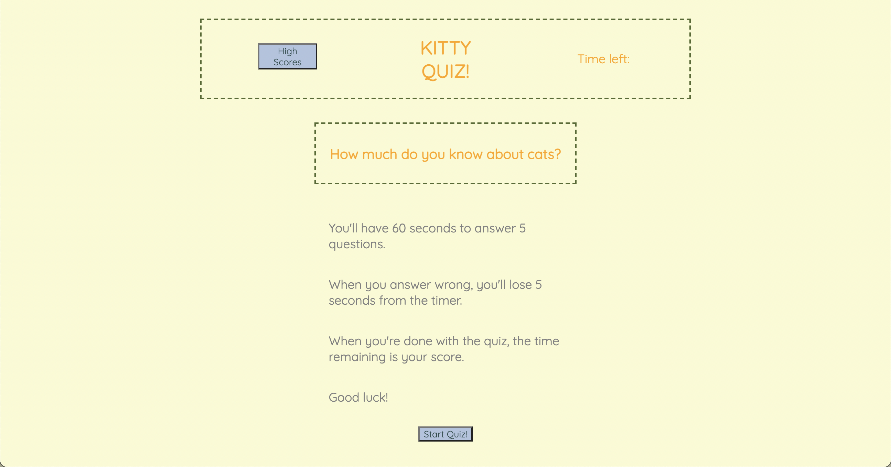
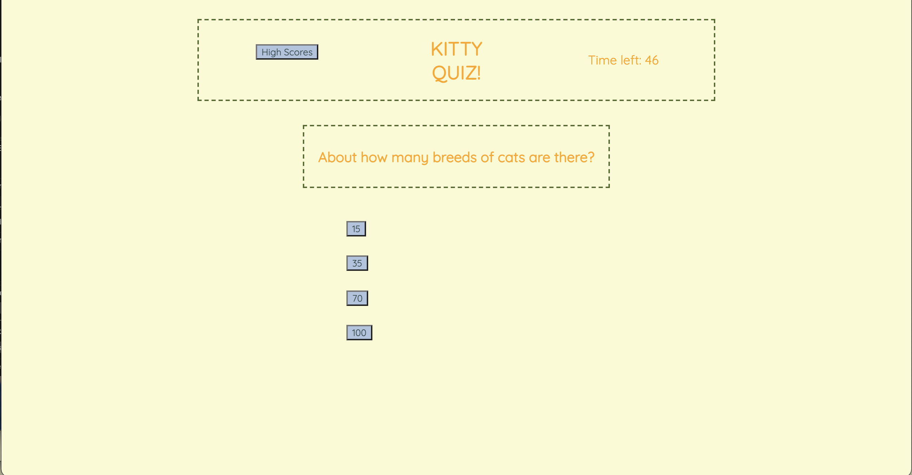
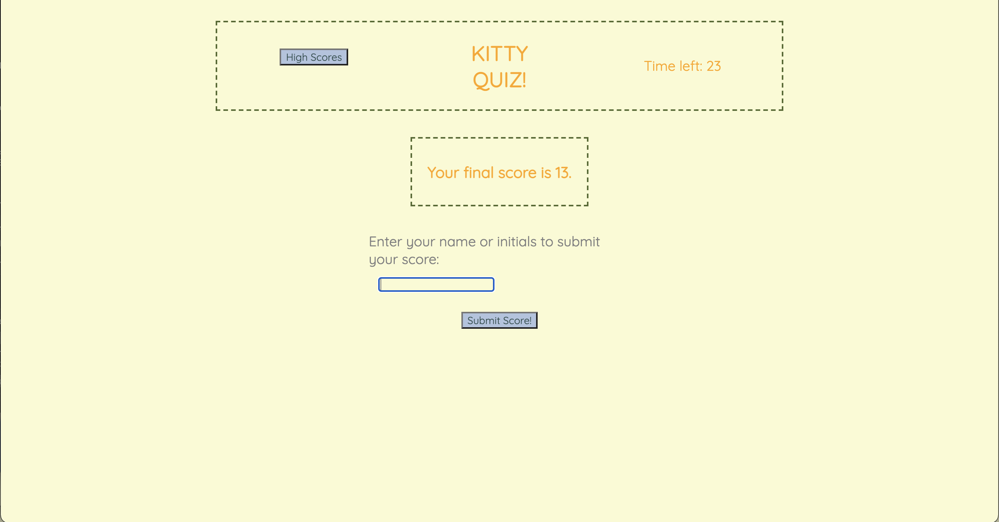

# Quiz-Game-Copy
Quiz game copy repo for bootcamp assignment

## About the App

This small quiz game is not only fun, but is meant to replicate a coding challenge an employer may assign you during the interview process. The assignment tests basic knowledge of HTML, CSS, and JavaScript to create an interactive application that is also dynamic, clean, and polished.

## Opening Page

The opening page provides instructions and presents the player with buttons that lead to a highscore leaderboard. There is also a start button that initiates the game and creates a new interface.

## Question Page

The question page provides the player with a question and 4 answers to choose from. When the player chooses an answer, multiple events occur at once; if the player chooses the correct answer, text appears saying "Correct!", and the next question will appear. If the player chooses the incorrect answer, text appears saying "Incorrect!", time is subtracted from the timer, and the next question appears. The timer runs in the upper right hand corner all the while.

## Score and Leaderboard Page

After the player answers all questions or when time runs out, the game will end and the final page will appear. Here, the player can view their final score and can add it to the leaderboard with their initials. Then, they can view their score and other saved scores from previous games. The player then has the choice to clear the scoreboard or return to the opening page.

